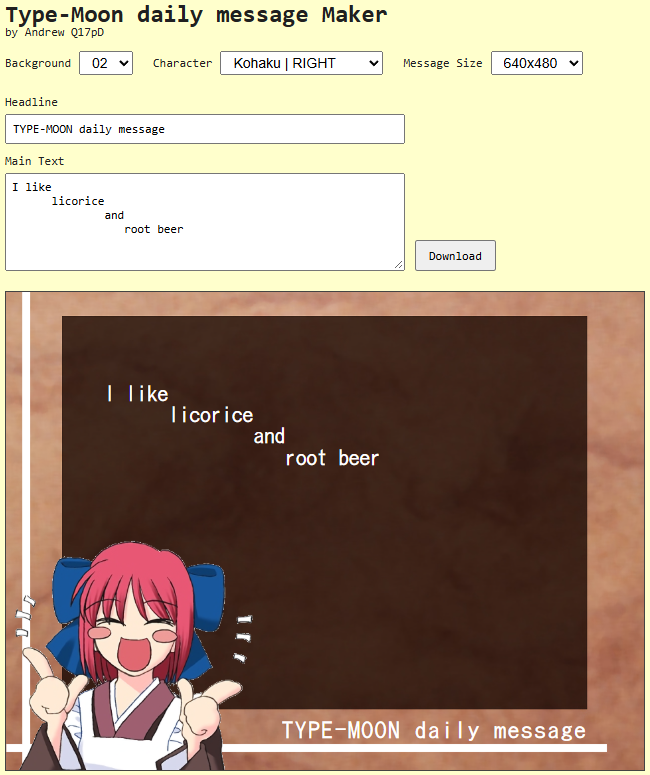
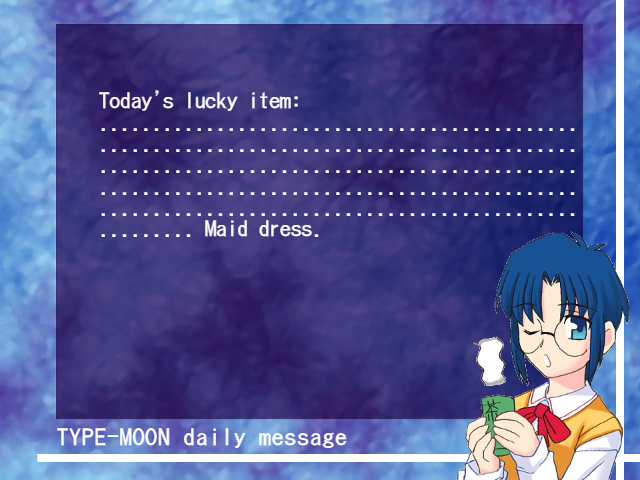

<h1 align="center">
   
  
   
  Type-Moon Daily Message Maker
   
</h1>

## [EN] What is this?

**Type-Moon Daily Message Maker** is a simple tool for creating **Startup Messages** from *Kagetsu Tohya*.
Yep, i was so lazy that day so i made this.

  
  

## [RU] Что это такое?

**Type-Moon Daily Message Maker** — простой инструмент для создания **стартовых сообщений**, из *Kagetsu Tohya*.
Да, мне было настолько скучно в тот день, что я сделал это.

  
  

